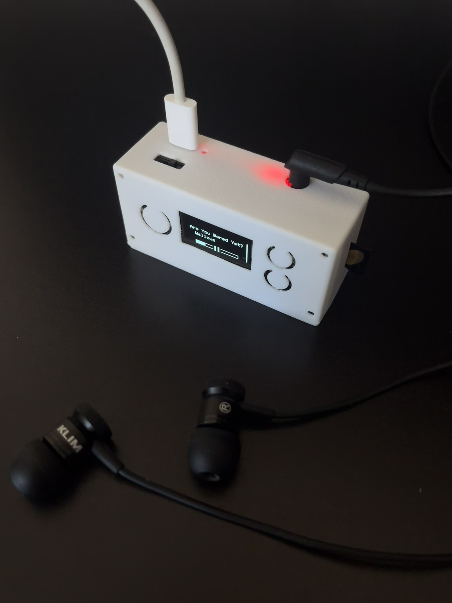

# MP3 Xiao

A portable DIY MP3 player built using the Seeed Studio XIAO ESP32-S3

## Overview

MP3 Xiao is a compact, battery-powered music player designed from scratch. It features SD card audio playback, a simple button-based interface, and a clean OLED display for navigation and playback information.

## Hardware Components
Microcontroller: Seeed Studio XIAO ESP32-S3

DAC: PCM5102A (I2S, 3.5mm audio output)

Storage: MicroSD card module

Display: SSD1306 OLED (128×64, I2C, 4-pin)

Input: 3× push buttons (via resistor ladder)

Power: LiPo battery with charging circuit (600mAh 3.7V 503040)

## Features
🎵 MP3 playback from SD card

📁 Album & Playlist selection

🔀 Sequential and shuffle playback options

🔊 Volume control

🔋 Portable battery-powered design

🧵 3D-printed case

🤏 Small form factor

## About the device
I was looking for a small, simple, cheap and high quality mp3 player but couldn't find one that fit all my needs - so I built one! All the components together cost less than $40 AUD, it fits in my pocket and the audio playback is crisp. The files in this repo consist of all my prototyping and testing to get all the components to work together, my C++ Arduino firmware for the device (including a python script to format the sd card so the esp32 can understand) and the CAD files for my 3d-printed case design. I also included some photos of the finished v1 decive.

## Updates
Currently working on V2 - a custom PCB to fit all the components into a nicer paackage.
