# MP3 Xiao

A portable DIY MP3 player built using the Seeed Studio XIAO ESP32-S3

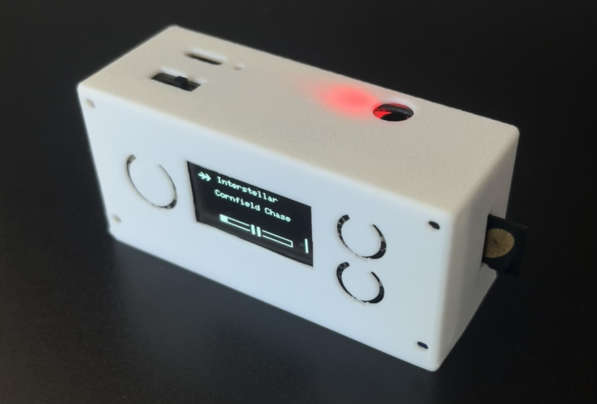

## Overview

MP3 Xiao is a compact, battery-powered music player designed from scratch. It features SD card audio playback, a simple button-based interface, and a clean OLED display for navigation and playback information.

## About the device
I was looking for a small, simple, cheap and high quality mp3 player but couldn't find one that fit all my needs - so I built one! All the components together cost less than $40 AUD, it fits in my pocket and the audio playback is crisp. The files in this repo consist of all my prototyping and testing to get all the components to work together, my C++ Arduino firmware for the device (including a python script to format the sd card so the esp32 can understand) and the CAD files for my 3d-printed case design. I also included some photos of the finished v1 device.

## Features
<table>
  <tr>
    <!-- Left column: features list -->
    <td valign="top">
      🎵 MP3 playback from SD card 
      📁 Album & Playlist selection 
      🔀 Sequential and shuffle playback options 
      🔊 Volume control 
      🔋 Battery powered with USB-C charging 
      🧵 3D-printed case 
      🤏 Small form factor
    </td>

    <!-- Right column: image -->
    <td>
      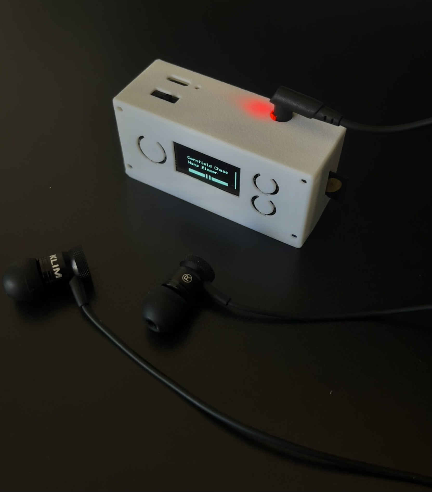
    </td>
  </tr>
</table>

## Hardware Components

| Component | Description | Image |
|-----------|------------|-------|
| Microcontroller | Seeed Studio XIAO ESP32-S3 | 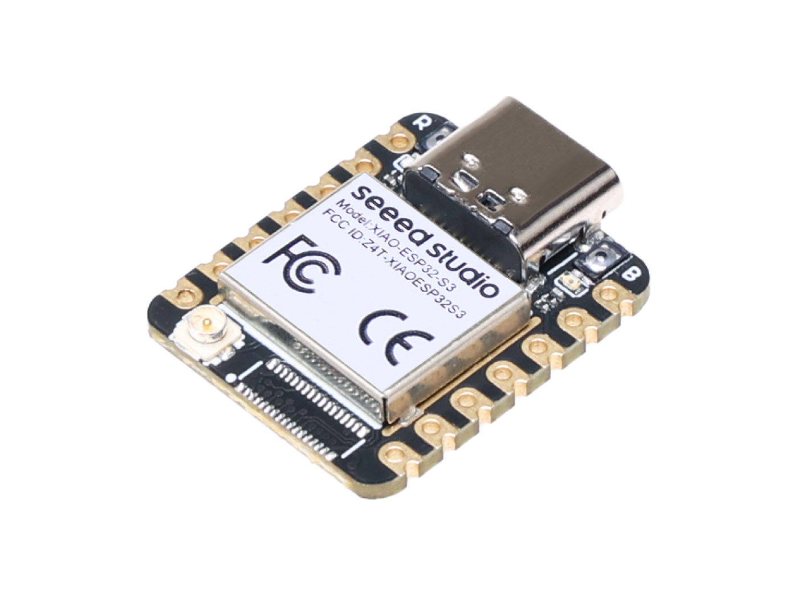 |
| DAC | PCM5102A (I2S, 3.5mm audio output) |  |
| Storage | MicroSD card module | 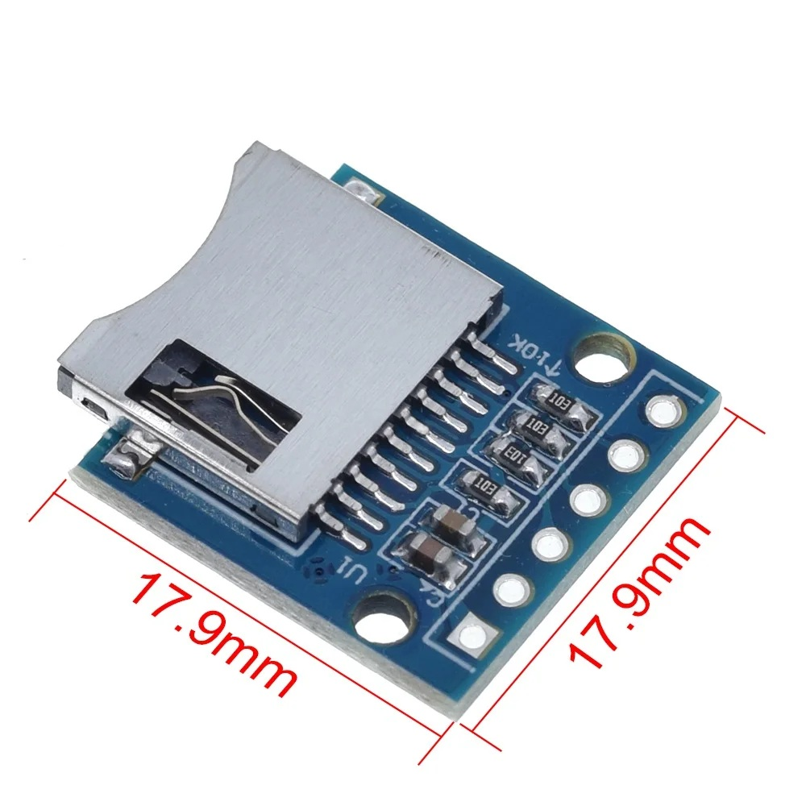 |
| Display | SSD1306 OLED (128×64, I2C, 4-pin) | 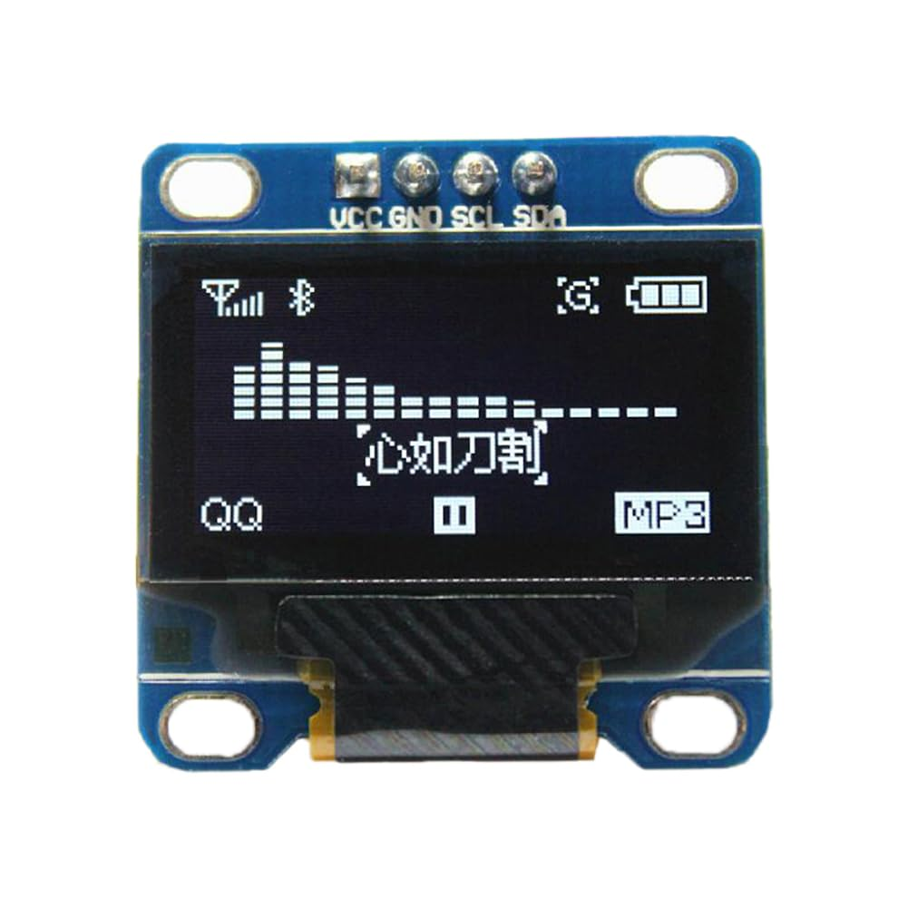 |
| Input | 3× push buttons (via resistor ladder) | 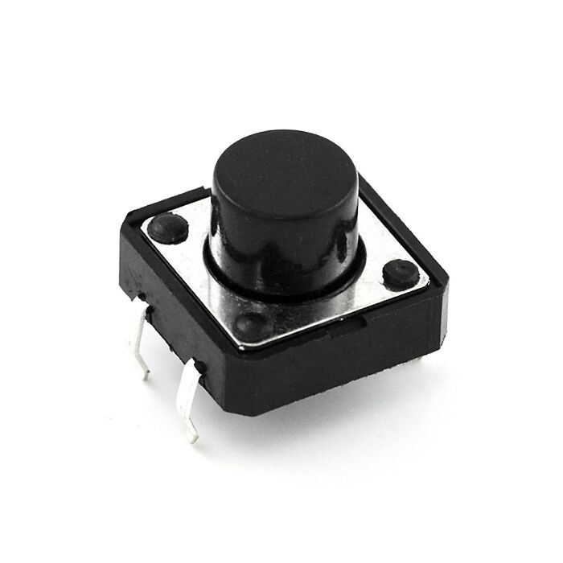 |
| Power | LiPo battery with charging circuit (600mAh 3.7V 503040) | 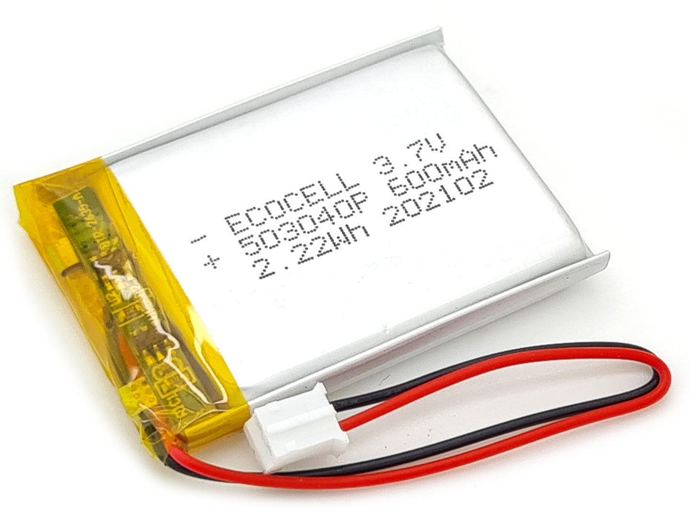 |

## UI Showcase

### Initialising...
Shows the text "Initialising..." on the OLED whilst the device sets up the SD card and chooses the first song to play.

### Shuffle All
On startup the device defaults to shuffle all mode, which plays tracks randomly from anywhere on the sd card. Shows song and artist name, along with a progress and volume bar.

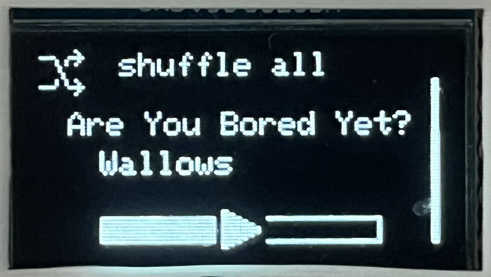

### Navigation
Hold down the big button to enter navigation mode, using the up and down button to select between Shuffle, Albums and Playlists, then release to continue.

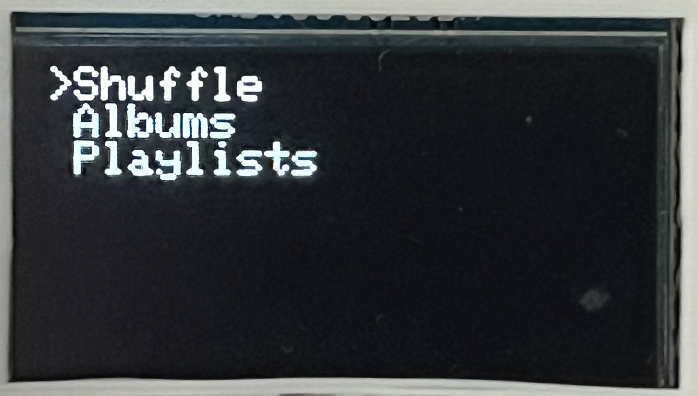

### Select
Displays all the albums or playlists stored on the SD card in alphabetical order. Use the up and down button to smoothly scroll through, and the big button to select.

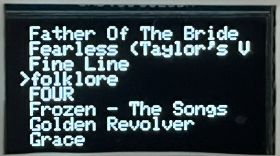

### Album Play
Displays the album name and a sequential indicator showing that it will play each song in album order. Shows song and artist name, along with a progress and volume bar.

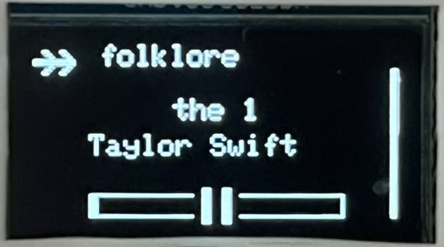

### Playlist Play
Displays the playlist name and a shuffle indicator showing that it will play songs in random order. Shows song and aritst name, along with a progress and volume bar.

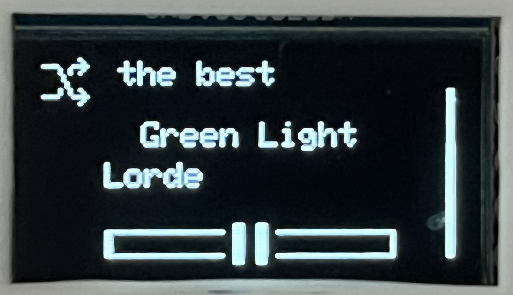

## Updates
Currently working on V2 - a custom PCB to fit all the components into a nicer package.
